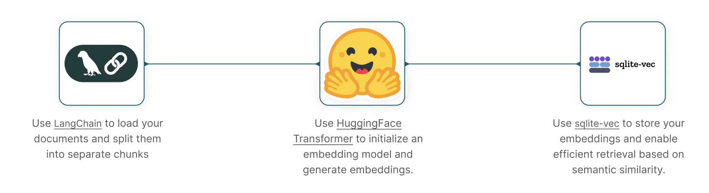

# (EXAMPLE/NON-FINAL) Build an AI-powered Local File-Retrieval System

This blueprint guides you to build an AI-powered system designed for local file retrieval. The system will use local language models and local indexing to retrieve files based on semantic user queries, providing fast and accurate access to files stored on local devices. It can support various file types, including text documents and PDFs.



## Pre-requisites

- **System requirements**: 
  - OS: Windows, macOS, or Linux
  - Python 3.10 or higher
  - Minimum RAM: 4 GB
  - Disk space: 1 GB minimum

- **Dependencies**:
  - Dependencies listed in `requirements.txt`
    
## Installation

1. Clone the repository:
   ```
   git clone https://github.com/mozilla-ai/Blueprint-local-file-retrieval.git
   cd Blueprint-local-file-retrieval
   ```

2. Run the setup script:
   ```
   sh setup.sh
   ```

3. Activate the virtual environment:
   ```
   source venv/bin/activate  # On Windows, use `venv\Scripts\activate`
   ```

## Quick-start

1. Add your data:

   •	Place your documents in the data/example_data/ directory. 

2. Configure settings (optional):
	
   •	Modify configs/config.yaml to adjust settings model_name, chunk_size, etc.

3. Run the application:
   ```
   python main.py
   ```

4. Query your documents:
	
   •	Follow the prompts to enter your queries and retrieve relevant documents.

## Project Structure
```
Blueprint-local-file-retrieval/
├── configs/                     # Config files
│   └── config.yaml              # Main config file for the project
├── data/                        # For storing document files
│   └── example_data/            # Sample data folder to place your files
├── notebooks/                   # Jupyter notebooks for interactive exploration
│   └── demo.ipynb               # Example notebook to demo
├── src/                         # Source code for app
│   ├── data_loader.py           # Module for loading and procesing documents
│   ├── embedding.py             # Module  for generating embeddings
│   ├── database.py              # Module for database operations with SQLite-vec
│   ├── query.py                 # Module for performing similarity search
│   └── utils.py                 # Util functions
├── .dockerignore                # Specifies files to ignore when building the Docker image
├── .gitignore                   # Specifies files to ignore in Git
├── Dockerfile                   # Docker  config
├── LICENSE                      # License for the project
├── README.md                    # Project documentation
├── main.py                      # Main script to run the file-retrieval system
├── requirements.txt             # List of Python dependencies
└── setup.sh                     # Setup script to create a virtual environment and install dependencies
```
## How it Works:

1.	**Document Loading**: Uses langchain to loads documents from the specified data folder, supporting various file types.
2.	**Text Splitting**: Uses langcahin to split the docs into smaller chunks based on chunk_size and chunk_overlap for efficient embedding.
3.	**Embedding Creation**: Each text chunk is converted into an embedding vector using a HF SentenceTransformer model.
4.	**Database Initialization**: SQLite-vec database is initialized to store the embeddings
5.	**Data Insertion**: Embeddings and associated metadata are inserted into the database.
6.	**Querying**: Users can enter queries, which are converted into embeddings and used to perform similarity searches against the database.
7.	**Result Presentation**: Retrieves and displays the most relevant document chunks based on similarity scores, and the associated file it was found in.

## Configuration and Customization

You can customize the system by modifying the `config.yaml` file. Key configurations include:

- `data_folder`: Path to the directory containing files to be indexed.
- `db_file`: Name of the SQLite-vec database file.
- `model_name`: Name of the HF model to use for embeddings.
- `chunk_size`: Number of characters per text chunk.
- `chunk_overlap`: Number of overlapping characters between chunks.
- `file_extensions`: List of file extensions to include when loading documents.
- `k`: Number of top similar documents to retrieve per query.

## (Optional) Docker Usage 

You can run the application inside a Docker container if required.

### **Build the Docker Image**

```bash
docker build -t local-file-retrieval:latest .
```

### **Run the Docker Container**

To use your own data, mount your data directory into the 
```bash
docker run --rm -it \
  -v $(pwd)/data/example_data:/app/data/example_data \
  local-file-retrieval:latest
```

## License

This project is licensed under the Apache 2.0 License. See the [LICENSE](LICENSE) file for details.

## Additional Resources

- https://future.mozilla.org/builders/news_insights/llamafiles-for-embeddings-in-local-rag-applications/
